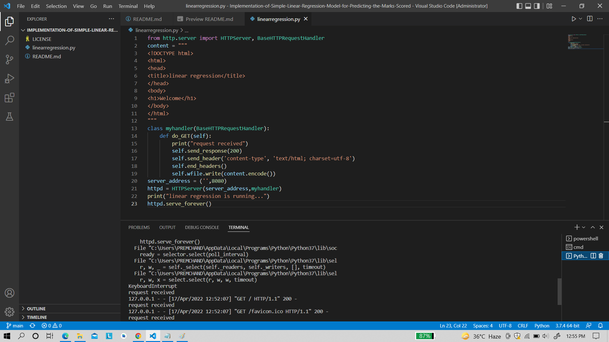
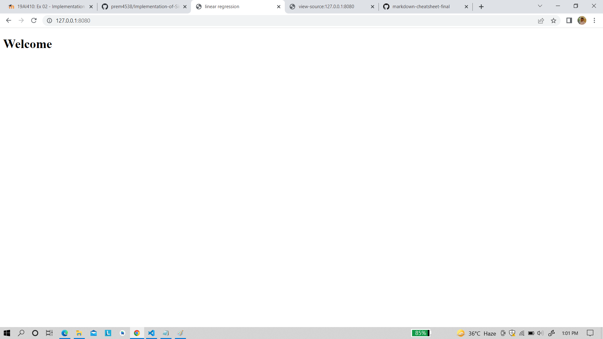

# Implementation-of-Simple-Linear-Regression-Model-for-Predicting-the-Marks-Scored

## AIM:
To write a program to implement the simple linear regression model for predicting the marks scored.

## Equipments Required:
1. Hardware – PCs
2. Anaconda – Python 3.7 Installation / Moodle-Code Runner

## Algorithm
### 1.
go to moodle,click the link and fork the experiment to your git hub account and again click fork
### 2.
create new folder in documents and name as my project 
### 3.
open visual studio code and clone the repositories to it 
### 4.
run necessary code in terminal and generate output and take screen shot of it make pdf and submit url link in moodle 

## Program:

```
from http.server import HTTPServer, BaseHTTPRequestHandler
content = """
<!DOCTYPE html>
<html>
<head>
<title>linear regression</title>
</head>
<body>
<h1>Welcome</h1>
</body>
</html>
"""
class myhandler(BaseHTTPRequestHandler):
    def do_GET(self):
        print("request received")
        self.send_response(200)
        self.send_header('content-type', 'text/html; charset=utf-8')
        self.end_headers()
        self.wfile.write(content.encode())
server_address = ('',8080)
httpd = HTTPServer(server_address,myhandler)
print("linear regression is running...")
httpd.serve_forever()
```

## Output:
### Server Side Output


### client Side Output


## Result:
Thus the program to implement the simple linear regression model for predicting the marks scored is written and verified using python programming.
