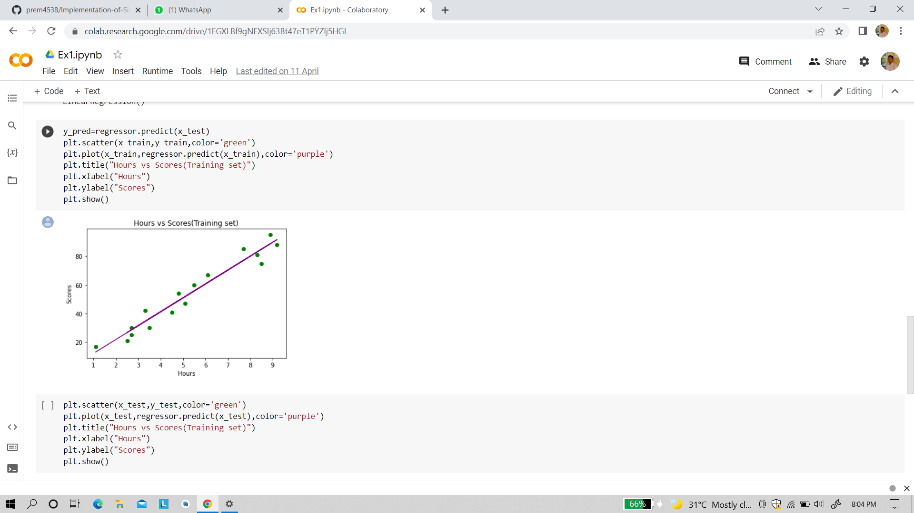

# Implementation-of-Simple-Linear-Regression-Model-for-Predicting-the-Marks-Scored

## AIM:
To write a program to implement the simple linear regression model for predicting the marks scored.

## Equipments Required:
1. Hardware – PCs
2. Anaconda – Python 3.7 Installation / Moodle-Code Runner

## Algorithm
### 1.
go to moodle,click the link and fork the experiment to your git hub account and again click fork
### 2.
create new folder in documents and name as my project 
### 3.
open visual studio code and clone the repositories to it 
### 4.
run necessary code in terminal and generate output and take screen shot of it make pdf and submit url link in moodle 

## Program:

```
import numpy as np
import pandas as pd
import matplotlib.pyplot as plt
dataset= pd.read_csv('student_scores.csv')
dataset.head()
X=dataset.iloc[:,:-1].values
X
y=dataset.iloc[:,1].values
y
from sklearn.model_selection import train_test_split
X_train,X_test,y_train,y_test=train_test_split(X,y,test_size=1/3,random_state=0)
from sklearn.linear_model import LinearRegression
regressor=LinearRegression()
regressor.fit(X_train,y_train)
y_pred=regressor.predict(X_test)
y_pred
y_test 
plt.scatter(X_train,y_train,color='orange')
plt.plot(X_train,regressor.predict(X_train),color='cyan')
plt.title("Hour vs scores(Training set)")
#plt.xlabel("Hours")
plt.ylabel("Scores")
plt.show()
plt.scatter(X_test,y_test,color='cyan')
plt.plot(X_test,regressor.predict(X_test),color='orange')#plotting the regression line
plt.title("Hours vs scores(Testing set)")
#plt.xlabel("Hours")
plt.ylabel("Scores")
plt.show()


```

## Output:
### Server Side Output


### client Side Output


## Result:
Thus the program to implement the simple linear regression model for predicting the marks scored is written and verified using python programming.
